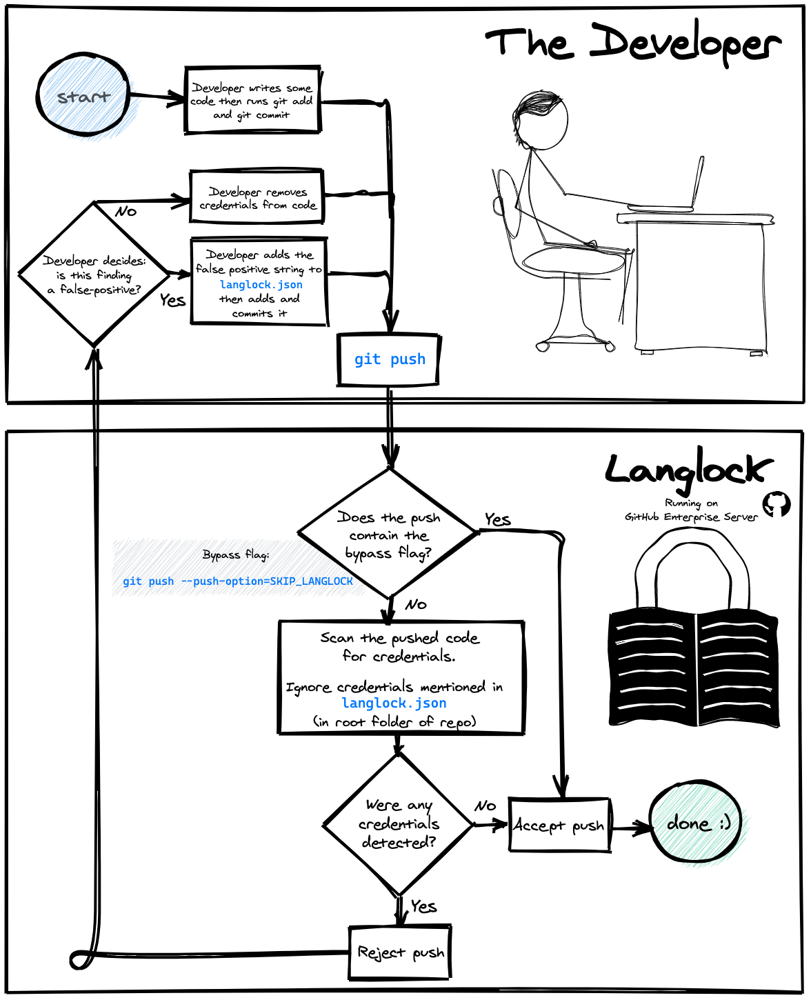

```
 _-_-                      ,,            ,,
  /,       _           _   ||            ||
  ||      < \, \\/\\  / \\ ||  /'\\  _-_ ||/\
 ~||      /-|| || || || || || || || ||   ||_<
  ||     (( || || || || || || || || ||   || |
 (  -__,  \/\\ \\ \\ \\_-| \\ \\,/  \\,/ \\,\
                      /  \
                     '----`   From the Vimeo security team
```

<div align="center" style="display:flex;flex-direction:column;">
  <a>
    
  </a>
</div>

## TL;DR

* Langlock is a new tool developed by the Vimeo Security Team. It blocks git pushes that contain hardcoded credentials (eg. passwords, api keys, oAuth tokens, encryption keys)
* No changes to your coding workflow, no new commands to learn
* Langlock runs server-side — there's nothing to install locally
* Blocked by a false positive? Add it to the allow list effortlessly! Whenever it blocks your push, Langlock provides a one-liner that you can copy and paste into your shell to update the allow list.
* In a pinch? Bypass Langlock with: `git push --push-option=SKIP_LANGLOCK`
* Langlock is currently enabled for only a few users and repos, as part of a gradual rollout, but eventually we'll turn it on for everyone. Let us know if you'd like to opt-in today :)
* REQUIREMENTS: Langlock works as either a pre-receive hook (it's main intended use) or as a standlone secret scanner. The pre-receive hook only works in environments that support pre-receive hooks, including **Github Enterprise Server** but `NOT` **Github Enterprise Cloud**. Several other source code management tools, including **Gitlab Self Managed**, **BitBucket Data Center**, and **BitBucket Cloud** do support pre-receive hooks, but Langlock has not yet been tested there.

## About

Langlock is a server-side tool that the Vimeo Security Team developed in Spring 2020 in order to help developers avoid accidentally leaking credentials (passwords, api keys, etc.) into git repositories.

Whenever you make a push to one of the github repos configured with Langlock, Langlock will automatically scan the diff of each commit in the push, and block the push if it detects any strings that look like credentials.  Langlock reads a JSON allow list file to permit pushes that contain false positives.

NOTE: Langlock is currently in a beta testing phase, so we have only enabled it for a handful of users and repos so far.

## Etymology

"Langlock" is the name of [a jinx that Harry Potter uses](https://www.hp-lexicon.org/magic/langlock/) to glue the target’s tongue to the roof of their mouth.


## How to use it (for developers who want to push code to repos protected by Langlock)

<div align="center" style="display:flex;flex-direction:column;">
  <a>
    
  </a>
</div>

Langlock runs as a server-side hook, so developers do not need to install any tools or edit any local configurations in order to use it.

Once Langlock has been [enabled for your repo](#how-to-enable-langlock-for-your-repo), simply interact with your code as you normally would, using all the git commands or IDE flows with which you're already familiar. There's no need to change your workflow or memorize any new one-liners.

When you push your code, Langlock will scan your new commits for any strings that resemble sensitive credentials (e.g. passwords, API keys, AWS access keys, SSH keys, .pem files). If Langlock does not detect any credentials, Langlock will quietly allow your push to occur as normal.

However, if Langlock does detect credentials, it will block your push and provide you with easy-to-follow instructions to either:
* **remove the detected credentials from your commits and then push again.** Purging credentials from existing commits can be tricky, especially if your git skills are rusty, so we've compiled a little guide showing [how to modify git history](). Furthermore, you may be wondering how to store and access credentials properly, since, as you now know, hardcoding credentials in source code is usually insecure. Many teams and projects have different strategies for safely storing credentials, depending upon their various technical requirements, so there is no one-size-fits-all solution. To help you out, we've compiled a list of [best practices for storing credentials safely](), but please consult with your team members too. As always, [reach out to the Security Team](#contact) if you'd like help.

OR

* **add the detected credentials to an allow list file, so that Langlock will ignore them and permit future pushes to proceed.** Don't worry, modifying the allow list is easy: every time that Langlock blocks a push, it will provide you with commands that you can copy and paste verbatim into your terminal to update the allow list (you never even have to open up a text editor). Only take this course of action if the detected string is definitely a false positive, ie. if the string is not actually a credential or secret. If in doubt, please see the [rules of thumb for deciding if a string is sensitive]() or [consult the Security Team](#contact).

That's it! That's all there is to it. Easy peasy!

If Langlock is malfunctioning, or otherwise slowing down your work excessively, please follow the instructions below for [overriding Langlock](#overriding-langlock).

## How to enable Langlock for your repo

Langlock can be enabled granularly for individual users and for specific repos. It is flexible enough to accomodate a scenario in which Bob would like Langlock enabled for himself only when using the "foo" repo, but Alice wants Langlock enabled for herself for all repos, and Mallory wants Langlock enabled for herself on all repos except for one. Alternatively, Langlock can easily be configured in a more coarse approach, in which it is enabled for all users and all repos.

There are two steps to configuring Langlock:
<ol>
<li><b>Ensure that Langlock is enabled within the settings of GitHub Enterprise Server</b> -- there are two specific settings to look at:
<ul>
<li>Enterprise-wide settings (applies to all orgs/repos within GitHub Enterprise Server -- <code>https://GITHUB_ENTERPRISE_SERVER_HOST/enterprises/ENTERPRISE_NAME/settings/hooks</code></li>
<li>Repo-specific settings -- <code>https://GITHUB_ENTERPRISE_SERVER_HOST/ORG_NAME/REPO_NAME/settings/hooks</code></li>
</ul>
Note that admin or repo owner privileges may be needed to modify these settings. If needed, please <a href="#contact">consult the DevEx or Security Team</a> for help. <a href="https://help.github.com/en/enterprise/2.17/admin/developer-workflow/managing-pre-receive-hooks-on-the-github-enterprise-server-appliance#configure-pre-receive-hooks-for-a-repository">These official instructions for GitHub Enterprise</a> may provide further guidance.
</li>
<li><b>Ensure that the <code>config.json</code> file in the root of the Langlock repo is correctly configured for the target user</b> -- follow the instructions later on in this document for setting the <code>ENROLLED_USERS</code> field within the <code>config.json</code> file. The <a href="#contact">Security Team</a> can help.</li>
</ol>

Langlock is currently in a beta testing phase, so we have enabled it only for a small handful of repos so far, but after we've given it thorough battle testing, we intend to deploy it to every repo in GitHub Enterprise for all users. If you'd like to try out Langlock now, without waiting, we invite you to do so by following the instructions in the previous paragraph. Please share any feedback!


## How to enable Langlock (for security engineers who want to deploy/configure/manage Langlock at their organizations)
<ol>
<li><b>Generate a Slack webhook URL</b> -- by following the instructions <a href="https://api.slack.com/messaging/webhooks">here</a>.</li>
<li><b>Prepare the "pre-receive hook environment"</b>
<ol>
<li><b>Clone/checkout the Langlock repo locally</b></li>
<li><b>Locally build the "pre receive hook environment" tarball</b> -- First navigate to the root of the Langlock repo and then run the command <code>./langlock.sh build SLACK_WEBHOOK_URL</code>. Note that you'll need the Docker daemon installed and running. If successful, this will produce a tarball. Note that you may need ensure that the script is executable first (<code>chmod +x langlock.sh</code>.</li>
<li><b>Upload the tarball generated from the previous step to your instance of GitHub Enterprise Server</b> - From the root of the Langlock repo, run the command <code>./langlock.sh deploy IP_ADDRESS_OF_GITHUB_ENTERPRISE_SERVER</code>. Note that you must have a "site admin" account in order to perform this operation. Additionally, you must have uploaded credentials to your account (https://GITHUB_ENTERPRISE_HOST/settings/keys).</li>
</ol>
</li>
<li><b>Create the new pre-receive hook</b>
<ol>
<li><b>Create a clone/fork of the langlock repo within your instance of GitHub Enterprise Server</b></li>
<li><b>- In a browser, navigate to the page for creating a new pre-receive hook (https://GITHUB_ENTERPRISE_HOST/enterprises/ENTERPRISE_NAME/settings/pre_receive_hook_targets/new).</b> Then:
<ol>
<li><b>In the "Hook name" field, type in a name for the new hook.</b> It can be anything (e.g., "Langlock").</li>
<li><b>In the "Environment" field, select the name of the environment </b> that you created and uploaded in the previous step.</li>
<li><b>In the "Script" field, select the Langlock repo and the <code>pre-receive-hook.sh</code> file.</b></li>
<li><b>In the "Enforcement" field, check the boxes that suit the needs of your organization</b> - Generally, for Langlock to be effective as a prevention mechanism, you must select the <code>Use the exit-status to accept or reject pushes</code> box.</li>
</ol>
</li>
</ol>
</li>
<li><b>Update the README and the config file to better meet the needs of your organization</b></li>
<li><b>(OPTIONAL) Update the README file</b> - In case end users (i.e. developers) in your organization want to visit the Langlock documentation, you can customize the README with information specific to your organization. In particular, you may want to include information on your rollout plan (gradual vs immediate, mandatory vs voluntary, etc.) as well contact information for support.</li>
<li><b>(OPTIONAL) Update the configuration file</b> - specifically, the <code>config.json</code> file located in the root of the Langlock repo hosted on your instance of GitHub Enterprise Server. The format is json with the following top level fields, each optional:
<ul>
<li><b>NUM_THREADS</b> - (integer) the number of concurrent threads that the GoLang binary will use when scanning the code for credentials. This number may significantly affect performance (recommended >= 4).</li>
<li><b>PROFILE</b> - (boolean) either "true" or "false" (boolean must be entirely lowercase). Indicate whether Langlock should, when scanning pushes, print performance profiling information (i.e., timestamps). This information will be printed to STDERR on client that invoked the push. Note that, for performance reasons, it is better to entirely comment out the <code>profile</code> function invocations in <code>pre-receive-hook.sh</code> instead of relying on this configuration option.</li>
<li><b>DEBUG</b> - (boolean) either "true" or "false" (boolean must be entirely lowercase). Indicate whether Langlock should, when scanning pushes, print debugging messages. This information will be printed to STDERR on client that invoked the push. Note that, for performance reasons, it is better to entirely comment out the <code>debug</code> function invocations in <code>pre-receive-hook.sh</code> instead of relying on this configuration option.</li>
<li><b>COLOR</b> - (boolean) either "true" or "false" (boolean must be entirely lowercase). Indicate whether color codes should be printed. Some IDEs do not properly render color escape sequences, in which case the characters will be printed as text and will not affect the color of the output.</li>
<li><b>ENABLE_OPT_IN</b> - (boolean) either "true" or "false" (boolean must be entirely lowercase). If you set this field to "true" then, by default, the server-side hook will by default skip scanning for all pushes, unless they contain the <code>--push-option=SECRET_SCAN</code> flag. This setting may be useful if you are planning to deploy Langlock with a gradual voluntary rollout.</li>
<li><b>BLOCK_PUSH_ON_TIMEOUT</b> - (boolean) either "true" or "false" (boolean must be entirely lowercase). Due to constraints imposed by GitHub Enterprise, Langlock must run in < 5 seconds. Unfortunately, for large pushes that contain many lines of code, Langlock may not finish scanning for credentials before the maximum allotted amount of time has elapsed. This configuration option indicates whether Langlock should block those pushes or allow them. In either case, a friendly message will be printed to the client indicating that the secret scanning ran out of time.</li>
<li><b>GRACEFUL_TIMEOUT_SECS</b> - (float) recommended values are 3.0 - 4.5. Must be > 0 and < 5. Due to constraints imposed by GitHub Enterprise Server, Langlock must run in < 5 seconds. If the server-side hook does not finish scanning for credentials in under 5 seconds, it will fail abruptly, automatically blocking the push with no helpful error message shown to the end user.
<br><br>Please note that this behavior is not a design decision of Langlock. Rather it is a strictly enforced and non-configurable constraint imposed universally upon all pre-receive hooks for GitHub Enterprise Server. (Also, please note that due to slight fluxations in behavior time-sharing systems (i.e., Linux), often the effective externally-enforced time limit is actually slightly less than 5 seconds).
<br><br>In order to avoid this abrupt unfriendly behavior for large pushes that may exceed the time limit, Langlock can voluntarily end its scanning slightly before the strict externally-enforced time limit is reached. This configuration value sets the maximum amount of time that Langlock should scan the push for secrets before voluntarily ending itself so that it has time to send a helpful error message to the client.
<br><br>If you set the value too low, then Langlock will not have enough time to scan moderate sized pushes. Conversely, if you set the value too high, then for large pushes, Langlock may exceed the time limit imposed by GitHub Enterprise Server and fail ungracefully, blocking the push without a helpful error message. On highly performant hardware, it may be possible to increase the value so that it is closer to 5.0.</li>
<li><b>ENROLLED_USERS</b> - (json object). If defined, this field specifies which users to enroll in scanning. Scanning will be skipped for all other users. For each username, you must provide a value. The value can be one of the following:
<ul>
<li><b>an empty json object (i.e., <code>{}</code>)</b> - scanning will be enabled for all repos for that user. E.g.,

```json
{
  "ENROLLED_USERS": {
    "ed": {}
  }
}
```
</li>
<li><b>a json object with the "scanRepos" key mapping to an array of repo name strings</b> - scanning will be enabled for this users for only the repos listed. E.g.,
<p>

```json
{
  "ENROLLED_USERS": {
    "ed": {
      "scanRepos": ["sampleorg/demo-repo-1"]
    }
  }
}
```
</p>
</li>
<li><b>a json object with the "skipRepos" key mapping to an array of repo name strings</b> - scanning will be enabled for this users for all repos EXCEPT those listed.

```json
{
  "ENROLLED_USERS": {
    "ed": {
      "skipRepos": ["sampleorg/demo-repo-1"]
    }
  }
}
```
</li>
</ul>
Please note that, if <code>ENROLLED_USERS</code> is not defined, scanning will be enabled for all users and all repos for which Langlock is configured.
</li>
<li><b>USERS_WITH_COLOR_ENABLED</b> - (json list of strings). Some users may want color output enabled for Langlock, depending on whether their IDE will properly render the colors (or just print the escape sequences as text). If defined, this field specifies which users will have color output enabled. Include a user in this list if you want them to have color output. Note that if the <code>COLOR</code> setting is set to <code>false</code>, then color output will be disabled for all users. Conversly, if <code>COLOR</code> setting is set to <code>true</code>, but he <code>USERS_WITH_COLOR_ENABLED</code> field is not defined, then color will be enabled for all users.
</ul>
<li><b>Ensure that Langlock is enabled for each repo</b> -- In a browser, for each repo on GitHub Enterprise Server for which you would like Langlock enabled, visit the <code>Settings -> Hooks</code> menu (<code>https://GITHUB_ENTERPRISE_SERVER_HOST/ORG_NAME/REPO_NAME/settings/hooks</code>`). Under the section titled "Pre-receive hooks," ensure that Langlock is enabled. Note that, as an alternative to enabling Langlock individually for each repo, there is an admin settings in GitHub Enterprise Server that allows enabling Langlock for all repos universally.</li>

We recommend enabling Langlock initially for only repo, so that you can test it out and ensure that it is working properly. Running the end-to-end tests (`./langlock.sh test-e2e`) is also recommended.
</ol>


## Why did Langlock block my push? How do I fix it?

<details><summary><b>Potential scenario 1: your git push contained strings that looked like sensitive credentials</b></summary>
<p>

When you push your code, if Langlock detects credentials, and those credentials are not included in the allow list file, Langlock will block your push and provide you with easy-to-follow instructions to either:
* **remove the detected credentials from your commits and then push again.** Purging credentials from existing commits can be tricky, especially if your git skills are rusty, so we've compiled a little guide showing how to modify git history. Furthermore, you may be wondering how to store and access credentials properly, since, as you now know, hardcoding credentials in source code is usually insecure. Many teams and projects have different strategies for safely storing credentials, depending upon their various technical requirements, so there is no one-size-fits-all solution. To help you out, we've compiled a list of best practices for storing credentials safely, but please consult with your team members too. As always, <a href="#contact">reach out to the Security Team</a> if you'd like help.

    OR
* **add the detected credentials to an allow list file, so that Langlock will ignore them and permit future pushes to proceed.** Don't worry, modifying the allow list is easy: every time that Langlock blocks a push, it will provide you with commands that you can copy and paste verbatim into your terminal to update the allow list (you never even have to open up a text editor). Only take this course of action if the detected string is definitely a false positive, ie. if the string is not actually a credential or secret. If in doubt, please see the [rules of thumb for deciding if a string is sensitive]() or <a href="#contact">consult the Security Team</a>.
</p>
</details>
<br/>


<details><summary><b>Potential scenario 2: your git push involved an improperly formatted allow list file</b></summary>
<p>

Langlock optionally accepts an allow list file so that developers may explicitly tell Langlock to ignore specific strings that it would otherwise flag as dangerous credentials. Whenever you make a push, you do not need to actively specify or pass the allow list file as an argument — instead, Langlock will automatically detect if an allow list is present by searching the root folder of the repo for a file named langlock.json. When searching for the file, Langlock includes the new commits of the current push in its search and takes the latest revision.

The allow list file is optional. If it's not present, Langlock will report all credentials that it detects with no exceptions.

Langlock expects the allow list file, if present, to have a very specific JSON scheme. If the file does not have the proper format, Langlock will block the push and provide instructions that show the proper expected scheme.

Ensuring that the allow list maintains the proper format should be easy, because whenever Langlock detects dangerous credentials and blocks a push, Langlock provides the user with verbatim shell commands for adding strings to the allow list, in case they are false positives.

Please <a href="#contat">consult the Security Team</a> if you need assistance.

</p>
</details>
<br/>

<details><summary><b>Potential scenario 3: Langlock malfunctioned or crashed</b></summary>
<p>

Langlock is a relatively new tool with several moving parts. We've done our best to test it, but there may still be a bug here or there. In the hopefully unlikely case that Langlock is misbehaving, please follow our instructions for <a href="#overriding-langlock">overriding Langlock</a>.
</p>
</details>


## Overriding Langlock

If Langlock is malfunctioning, or otherwise slowing down your work excessively, please override Langlock by appending the argument `--push-option=SKIP_LANGLOCK` to your `git push` command.

Please make sure to use this feature sparingly and with discretion. With great power, yada yada...

The Security Team will receive a notification that you bypassed the check, and we may reach out to you so that we can better understand the bugs and pain points of Langlock and identify ways to reduce friction for developers in the future.

_If you are using an IDE and have trouble appending custom options to your git pushes, we recommend pushing your code using the git CLI in a terminal. To do so: open a terminal, navigate to the root folder of your repo, and run the command `git push --push-option=SKIP_LANGLOCK` verbatim. Please [contact the Security or DevEx Team](#contact) for help._


## FAQ

<details><summary><b>Why is Langlock necessary?</b></summary>
<p>

Sometimes small actions have big consequences. Hardcoding a credential into source code is a small action. The wrong person getting ahold of that credential and then using it for evil could be a big consequence. In fact, it could be a company-ending event. I won't paint a detailed step-by-step picture here, but it doesn't take much creativity to connect the dots.

Ideally, most Enterprise systems would be resilient enough such that the leakage of a single credential could not cause catastrophic harm to the business. However, many companies are quite far from that ideal, as are the vast majority of Internet-based companies.

In lieu of that resiliency, we must take strong precautions to prevent leaking credentials in the first place.

You might reasonably be asking yourself: does hardcoding a credential into a private repo, only available to my organizations employees, really constitute a leak?

To be clear, "leak" is not an official term and hardcoding credentials into private repos is generally not a press-worthy offense. However, hardcoding credentials does dramatically increase the likelihood that a sensitive credential will fall into the wrong hands.

To understand why, first consider how many people have access to your organizations private repos.  Trusting that many people may be downright negligent. In security parlance, we call this risk "Insider Threat". Compound that number with the observations that:
<ul>
<li> many of those contributors are actually former employees, some who may harbor ill will toward the company</li>
<li> the number of contributors will only continue to grow in the future with new employees whom we've never met before and whom we currently have little or no basis to trust</li>
<li> many of those contributors have roommates, family members, or fellow coffee-shop patrons who may occasionally have brief unmonitored access to the contributor's unlocked laptop</li>
</ul>

Furthermore, even if there's no malice or greed involved on the part of insiders, accidents do happen. For example, it is not uncommon for software engineers, for the sake of convenience, to accidentally make public copies of private repos on github, thereby exposing both their org's proprietary intellectual property as well as several credentials critical to the security of end users' data.

My point is: placing credentials in a repo, even a private repo, is quite risky. The likelihood of a bad actor getting ahold of those credentials is high, as is the potential impact. To reduce that risk, the best course of action in the near future is to:
<ul>
<li>stop placing credentials in source code (that's the point of Langlock!)</li>
<li>use safer alternative techniques for storing and accessing credentials, such that our credentials are only accessible on a limited basis according the security principles of "need to know" and "least privilege."</li>
</ul>

</p>
</details>
<br/>

<details><summary><b>I deleted a credential from my code. Why did Langlock block my push?</b></summary>
<p>
Deleting a credential from your code does not necessarily remove the credential from git history. Rather, it only removes the credential from the current and future revisions of the source code. Anyone who inspects the commit in which you performed the deletion (eg. using <code>git show COMMIT_ID</code> or <code>git log -p</code>) will be able to see the credential!

(Note that, if the string is not actually a sensitive credential, per our guidelines [here](), you may simply add the string to the allow list without removing it from the git history.)

To properly remove the credential, so that Langlock allows your push to proceed, there are two alternative solutions, and only one of them will be suitable for you situation:
<ul>
<li><b>If the credential ALREADY EXISTED in the repo prior to your push...</b></li>
In this case, the credential had already been leaked to the upstream repo even before your push. The recommended course of action is to rotate the credential, ensuring that its new value never enters the repo. During rotation, you may add the previous value of the credential to the allow list.
<li><b>Otherwise, if the credential DID NOT EXIST in the repo before your push, and one of your commits introduced it (even if a later commit in your push removed it)...</b></li>
In this case, the credential has not yet entered the upstream repo in github, so if you remove it now from your commits in your local git repo, you'll avoid leaking it. Removing a credential from commits in your push may be tricky, especially if your git skills are rusty, so we've compiled <a href="">a little guide to help</a>.
</ul>

In both cases, you may want to consult a guide on the best practices for storing credentials securely, since putting credentials in the source code is not a smart option.

</p>
</details>
<br/>

<details><summary><b>What is the proper way to store and access credentials, instead of hard coding them in source code?</b></summary>
<p>
There are a vartiety of techniques for credential storage and access that are dramatically more secure than hardcoding plaintext strings in source code. A few strategies employed by various teams include: using HashiCorp Vault, using K8s Secrets, and hardcoding encrypted credentials into config files in source code. Each of these techniques has various tradeoffs, so different teams may have their own preferences, based on the requirements of their particular engineering challenges or based on famility and existing patterns.

The Security Team is currently drafting a guide of Best Practices on this topic. In the meantime, please <a href="#contact">reach out to the Security Team</a> if you'd like help finding a way to safely store and access credentials for your application.

</p>
</details>
<br/>


<details><summary><b>How do I remove a credential from git history?</b></summary>
<p>

The two most helpful commands for modifying git history are:
<ul>
<li><code>git rebase -i</code>
</li>
<li><code>git commit --amend</code>
</li>
</ul>
Both of the above commands are quite powerful and flexible, but they have a steep learning curve and therefore a thorough tuturial is out of scope for this README. Plenty of documentation and free guides are available online. Please <a href="#contact">reach out to the Security Team</a> if you'd like help.

Note, however, that the above two commands do not necessarily enable you to modify the instances of the repo on other developers' machines or on the central GitHub Enterprise server. Often you only have access to modify the history of your own local instance of the repo. Moreover, once you make a push to a central repository that is accessible by other developers, there is no convenient way to retract the pushed information and guarantee that others do not see it, in the case of an accidental leak.

</p>
</details>
<br/>

<details><summary><b>Does Langlock work with IDEs?</b></summary>
<p>

We have tested Langlock with the following IDEs:
<ul>
<li>Git in VS Code</li>
<li>GitLense in VS Code</li>
<li>GitHub Desktop</li>
<li>SourceTree</li>
<li>GitKraken</li>
</ul>

All of the IDEs above work harmoniously with Langlock, with the following exceptions:
<ul>
<li>GitKraken</li>
If your push is blocked, GitKraken will not render any of the helpful error messages that Langlock provides to help you resolve the issue. We recommend re-trying the push from a terminal: simply open a terminal, naviate to the root folder of the repo, and run `git push`. The terminal will display Langlock's friendly error messages.
<li>Git in VS Code</li>
If your push is blocked, VS Code will not immediately render any of the helpful error messages that Langlock provides to help you resolve the issue. Simply remember to click the "Open Git Log" button in the popup notification to view Langlock's helpful error message.
<li>GitLense in VS Code</li>
If your push is blocked, VS Code will not immediately render render any of the helpful error message that Langlock provides to help you resolve the issue. Simply remember to click the "Open Git Log" button in the popup notification to view Langlock's helpful error message.
</ul>

Unfortunately, there is no easy way to use Langlock's [override-feature](#overriding-langlock) while using any of the IDEs, because the override feature requires the user to append additional arguments to the `git push` command, which none of the IDEs support. Most of the IDEs solely expose a single "push" button that is not configurable. In case you do regularly rely on an IDE and you do need to override Langlock in your push, your best course of action is to open up a terminal on your workstation, navigate to the root directory of your repo, and then run `git push --push-option=SKIP_LANGLOCK`.

Our aim, however, is that users will rarely, if ever, need to use Langlock's override feature, because Langlock will operate smoothly the vast majority of the time.

Furthermore, whenever Langlock detects credentials and blocks a push, Langlock provides instructions for adding those credentials to the allow list in case the user decides that they are false positives. Those instructions are shell commands. If your IDE does not expose a shell or command line interface, you can simply open up a terminal, navigate to the root directory of the repo, and then copy and paste those instructions verbatim into the terminal (but only if the credentials actually are false positives).

Please [reach out to the security team](#contact) if you'd like help.
</p>
</details>
<br/>

<details><summary><b>Does Langlock examine the entire file, or just the diff?</b></summary>
<p>
Langlock only examines the lines of code that have been added, updated, or moved in the commits of your push. Langlock does not examine any removed or unchanged lines, so Langlock should not usually warn you about existing credentials in the repo.

Be mindful, however, that even a small change to a line, eg. removing superfluous whitespace, will trigger Langlock to analyze the entire line, potentially detecting credentials that were already present in the line.
</p>
</details>
<br/>

<details><summary><b>What is the allow list file?</b></summary>
<p>

The allow list is a JSON file that developers can manually update by themselves anytime in order to indicate specific strings or directory paths that Langlock should ignore. Usually developers will add a string to the allow list when Langlock has blocked their push because of a false positive finding (ie. a string that Langlock detected but that is not actually a real credential).

Generally you'll never need to manually open, read, or edit the allow list file by hand because, whenever Langlock detects a credential and blocks a push, Langlock provides a one-liner terminal command for updating the allow list.

Note that, for security reasons (*\*cough\** a minor bit of obscurity *\*cough\**), the allow list does not actually contain the plaintext of the strings that it allows. Rather, the allow list includes only hashes of those strings, along with some optional metadata.

The allow list file must be named <code>langlock.json</code> and it must be located in the root directory of the target repo. Each repo with Langlock enabled may have its own allow list, but there is also a global allow list in the root of the Langlock repo itself. The two allow lists (per-repo and global) are effectively concatenated during execution.

Here is an example allow list json file:
```json
{
  "allowPaths":
	[
    {"regex": ".*[.]jpg$", "reason": "JPEG files generally do not contain source code. Skip scanning to save time and avoid noisy output."}
  ],
  "allowStrings": {
    "9d3ca8abbd1ace2b71cfc512c2235e53059b24b1d4729dbcf987b361996fdd49": {
      "rule": "AWS Manager ID",
      "locations": [
        {
          "path": "bar.php",
          "commit": "ca9c8965537fc2c4f7b8329cc966b51465107bc2"
        }
      ],
      "reason": "This is a false positive. The secret scanner mistakenly reported a string that was just a variable name, not an actual AWS manager ID."
    }
  }
}
```

Note that you may generate the hashes locally using the following command: `./langlock.sh hash STRING_TO_HASH`

</p>
</details>
<br/>


<details><summary><b>Can I use the bypass/override flag everytime I push?</b></summary>
<p>
This would defeats the purpose of Langlock, and ultimately exposes your organization to much greater security risks. The tool has been designed to introduce as little friction as possible. If you do encounter friction, please notify the Langlock authors or your local github administrators.
</p>
</details>
<br/>

<details><summary><b>How do I know if Langlock is running for my repo?</b></summary>
<p>
There are two different ways to determine if Langlock is enabled for your repo:
<ul>
<li>
<b>Look at the output of a git push command</b> -- If Langlock is enabled for your repo, it will always return some output text, usually either a success message or a failure message if it detects credentials.
</li>
<li>
<b>Visit the settings for the repo</b> -- An admin or owner of the repo in GitHub Enterprise can easily view the hooks that are enabled for their repo by following [these instructions](https://help.github.com/en/enterprise/2.17/admin/developer-workflow/managing-pre-receive-hooks-on-the-github-enterprise-server-appliance#configure-pre-receive-hooks-for-a-repository). Please <a href="#contact">reach out to the Security or DevEx Team</a> if you'd like assistance.
</li>
</ul>
</p>
</details>
<br/>

<details><summary><b>My team does not use GitHub Enterprise. Can we still use Langlock?</b></summary>
<p>
The security would prefer that every team begin using Langlock for almost every repo, in the near future.

Unfortunately, not every git-centric platform is capable of supporting Langlock. The main reason is that Langlock relies heavily on the "pre-receive hook" feature of git server, and some platforms do not support that feature.

For teams that currently use github.com or GitLab instead of GitHub Enterprise, the Security Team will either attempt to deploy Langlock to those platforms, if they support pre-receive hooks, or will encourage those teams to migrate to GitHub Enterprise.

In either case, the Security Team will collaborate with your team closely to ensure that we reach a mutually favorable solution.

</p>
</details>
<br/>


<details><summary><b>There were already a ton of credentials in our repo, even before my push. Are we planning to remove them?</b></summary>
<p>
Yes, the long-term goal of many organizations is to ensure that every repo is completely free of sensitive credentials.

However, it often is helpful to start addressing this big challenge by plugging the leak before bailing out the existing water.

Langlock is a strong way of preventing the credential problem from getting any worse than it already is. Separate initiatives can address the backlog of credentials that have already been leaked.
</p>
</details>
<br/>

<details><summary><b>Why is it called Langlock?</b></summary>
<p>
Please see our <a href="#etymology">etymology</a>.
</p>
</details>
<br/>

<details><summary><b>How do I add a new scanning rule to Langlock?</b></summary>
<p>
Please visit the <code>src/detectcreds/rule/defaultrules.go</code> file to create, read, update, or delete rules. Note that if you update any rules, you will need to redeploy the pre-receive hook environment for them to take effect.

You can test your rule modifications locally by running `./langlock.sh scan PATH_TO_TARGET_FILE` or `./langlock.sh scan-dir PATH_TO_TARGET_DIR` locally, or by running the unit tests for the scanner with `./langlock.sh test-scanner`. Also, remember that you have to re-build the GoLang code after modifying it for your changes to the GoLang code to take affect locally (`./langlock.sh build-local`)

Note that the quantity of scanning rules and their individual regexes may dramatically affect Langlock's scanning performance. Profiling is recommended (e.g., `.langlock.sh build-local; time ./build/detectcreds.bin PATH_TO_TARGET_FILE`) to ensure that rule modifications do not compromise performance.
</p>
</details>
<br/>

<details><summary><b>Does Langlock have any known limitations?</b></summary>
<p>
Yes. The main limitations of Langlock include:
<ul>
<li><b>Langlock often does not detect low-entropy secrets</b> -- Designing any secret scanning algorithm requires a delicate balance between heuristics that increase the number of true-positive (i.e. valid) findings and reduce the number of false-positive findings.

As part of Langlock's strategy to reduce false positives, several of its detection rules ensure that the detected credential actually have the characteristics of high-quality secrets, including a relatively even frequency of character tuples. Many low quality passwords (e.g. "passw0rd") do not meet that criterion, so in some cases, Langlock errs on the side of assuming that the given string is not actually a credential.
<li><b>Langlock MUST run quickly </b> Due to mandatory non-configurable timing constraints posed on all pre-receive hooks for GitHub Enterprise Server, Langlock is constrained to finish running in < 5 seconds per invocation. A consequence of this performance constraint is that every detection rule that Langlock uses must be efficient. Moreover, the rules must be efficient collectively. In some cases, this means not including slow-running rules or rules for obscure credential formats that would rarely fire.</li>

Additionally, for large pushes, Langlock may not finish scanning in the allotted amount time. In these cases, Langlock prints a helpful error message to the user with instructions for re-running the push and bypassing Langlock. The team configuring Langlock may decide whether a push that times out should be accepted or rejected (despite not being fully scanned for creds).

</li>
</ul>
</p>
</details>
<br/>

## Contributing

Have an idea to improve Langlock? Found a bug that you'd like to fix? Please see the [CONTRIBUTING.md](./CONTRIBUTING.md) file.

## Contact

If you have questions or need help, please contact your Github administrators.

# Who made this

Built by Ed Sullivan ([@ed-sulli](https://github.com/ed-sulli)).

The engineering and security teams at [Vimeo](https://github.com/vimeo) have provided a lot of encouragement.
